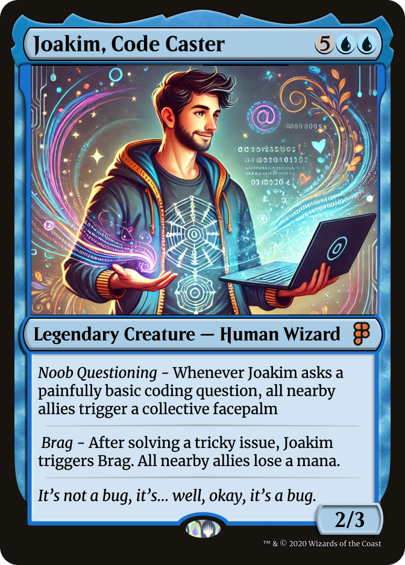

<h1 align="center" style="font-family: 'Poppins', sans-serif; font-size: 3rem;">Joakim Helgodt</h1>

  

  🧑‍💻 Fullstack Developer | 🚀 Tech Enthusiast | 🎯 Former SaaS Sales Executive turned Coder

---

### 🌟 About Me

Hi, I'm Joakim Helgodt, a passionate Fullstack Developer with a knack for building modern, scalable web applications. I transitioned from SaaS sales to coding, and now I enjoy crafting solutions that make a difference. When I'm not coding, you can find me playing Magic: The Gathering or exploring new tech trends.

---

### 🔭 Current Projects

- 🚀 Building [my portfolio website](https://joakimhelgodt.com) with Angular & SCSS
- 🃏 Magic the Gathering Deck Builder

---

### 🧰 Tech Stack

**Frontend:** Angular · React · TypeScript  
**Backend:** PHP · Laravel · MySQL · Node.js · MongoDB  
**Tools:** Git · GitHub · Docker · Figma · VS Code

---

### 📊 GitHub Stats

  
  

---

### 🎨 Featured Asset

  

---

### 📫 Connect with Me

  
  
  

